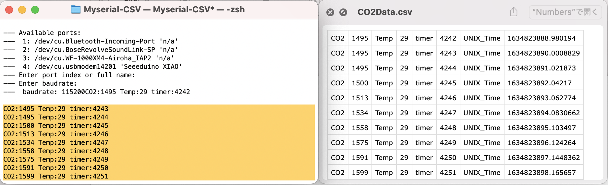

# About Myserial-CSV


**Arduinoなどのシリアル出力をUSBポート直読みでCSV出力できるツール。以前作っていたMyserialのオルタナティブ版**


## pipenvでの環境構築

1. **Pipenvのインストール**
    
    Pipenv自体のインストールはpipから行えます．
    
    ```bash
    pip install pipenv
    ```
    
2. **python3の環境構築を行う**
    
    このコードを動かすディレクトリを作るりそこにファイル一式を入れる
    
    - ファイル
        - main.py
        - requirements.txt
    
    ```bash
    pipenv --python 3.9.7    # Python3系で初期化する例
    ```
    
3. **requirements.txtからライブラリをインストール**
    
    ```bash
    pipenv install -r ./requirements.txt
    ```
    

[pipenvの環境開発の仕方](https://qiita.com/y-tsutsu/items/54c10e0b2c6b565c887a)

# **使い方**

1. `python main.py`で実行
2. どのシリアルポートを使うか聞かれるので番号を入力してEnter/returnする(Enter port index or full name:)
3. ボーレートを聞かれるので任意の数値を入力する(Enter baudrate:)
4. あとは勝手に始まります。終わる時は`control+c`で終了してください。